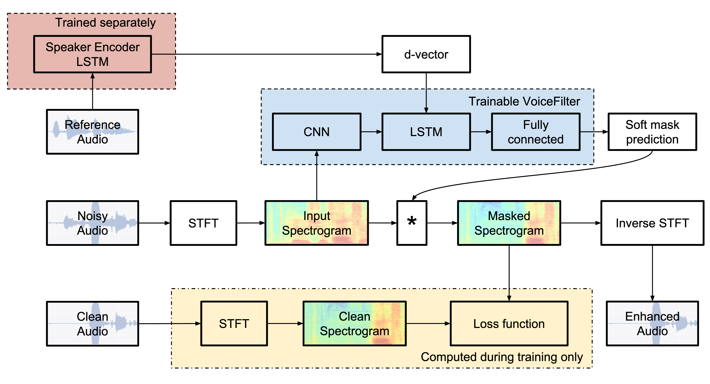

# voicefilter
This repo contains the unofficial implementation of VoiceFilter, a method for separating the voice of a target speaker from multi-speaker signals. The system take both noisy spectrogram and speaker embedding as input, and produce a mask.

To learn more, please check out this paper [VoiceFilter: Targeted Voice Separation by Speaker-Conditioned Spectrogram Masking](https://arxiv.org/pdf/1810.04826).

---

## Requirements

## Models
1. Voice encoder to extract dvector embedding of speaker 

2. Voicefilter checkpoints 
## Usage
1. Download [LibriSpeech dataset](https://www.openslr.org/12/), train-clean-100.tar.gz and dev-clean.tar.gz.
2. unzip the file and convert flac into wav.
3. generate data pairs for mixing audio.
4. train the voicefilter
## TODO
1. verify all code, preprocess.py is good.